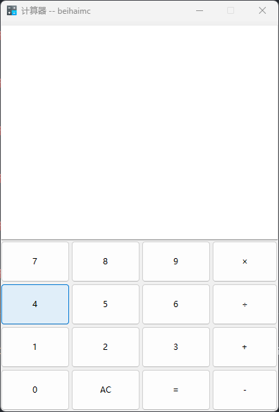

# Python 计算器 GUI

一个使用 **Python Tkinter** 制作的简易计算器，支持数字输入、基本四则运算以及键盘快捷操作，并带有按键音效。适合学习 Python GUI 编程或快速使用的桌面计算器工具。

---

## 功能特性

- 支持数字 `0-9` 输入  
- 支持基本运算符：加 `+`、减 `-`、乘 `*`、除 `/`  
- `AC` 按钮清空当前表达式  
- `=` 按钮计算表达式结果  
- 支持键盘输入（数字键、运算符、回车、Backspace 或 Esc 清空）  
- 按键伴随音效（Windows 专用）  
- 界面简洁，使用 **Tkinter** 构建  

---

## 界面预览

  

---

## 安装与运行

1. 安装 Python（推荐 Python 3.8+）
2. 确保项目目录下有按键音效文件 `press.wav` 和图标文件 `icon.ico`
3. 运行：
   ```bash
   python calculator.py

